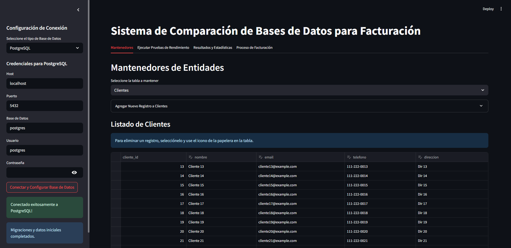

# Multi-Spaces Application

Esta aplicación es una herramienta Streamlit diseñada para gestionar y analizar datos de facturación, clientes, productos y personal, con soporte para múltiples bases de datos.

## Ejecución de la Aplicación

Para iniciar la aplicación Streamlit:

`streamlit run ./app_launcher.py`

## Estructura del Proyecto

El proyecto sigue una arquitectura hexagonal, separando la lógica de negocio del dominio de los detalles de infraestructura.

*   `application/`: Contiene la lógica de negocio y los servicios de la aplicación.
    *   `ports/`: Define las interfaces (puertos) que la aplicación utiliza para interactuar con el exterior.
    *   `services/`: Implementa los casos de uso y la lógica de negocio.
*   `domain/`: Contiene el modelo de dominio y los servicios de dominio.
    *   `model/`: Define las entidades y objetos de valor del dominio.
    *   `services/`: Lógica de negocio central que no depende de la infraestructura.
*   `infrastructure/`: Contiene las implementaciones de los puertos (adaptadores) y la configuración.
    *   `adapters/`: Implementaciones de los puertos para la entrada (UI) y la salida (conectores de DB, persistencia).
        *   `in_/ui/`: Interfaz de usuario basada en Streamlit.
        *   `out/connectors/`: Conectores específicos para diferentes bases de datos.
        *   `out/persistence/`: Lógica de persistencia y repositorios.
*   `shared/`: Módulos o utilidades compartidas.
*   `app_launcher.py`: Punto de entrada principal para iniciar la aplicación.
*   `requirements.txt`: Lista de dependencias de Python.

## Configuración del Entorno

### Requisitos Previos

*   Python 3.x
*   `pip` (gestor de paquetes de Python)

### Instalación de Dependencias de Python

1.  Clona este repositorio:
    `git clone [URL_DEL_REPOSITORIO]`
    `cd multi-spaces`
2.  Crea un entorno virtual (opcional pero recomendado):
    `python -m venv venv`
    `.\venv\Scripts\activate` (Windows) o `source venv/bin/activate` (Linux/macOS)
3.  Instala las dependencias de Python:
    `pip install -r requirements.txt`

### Configuración de Conectores de Base de Datos

Esta aplicación soporta múltiples bases de datos. Algunos conectores requieren pasos adicionales más allá de `pip install`. Si planeas usar una base de datos específica, sigue las instrucciones correspondientes. La aplicación ha sido modificada para que los errores de importación de drivers solo se presenten cuando intentes conectar a la base de datos correspondiente.

#### 1. PostgreSQL

*   **Driver de Python**: `psycopg2-binary` (ya incluido en `requirements.txt`).
*   **Requisitos adicionales**: No se requieren instalaciones de controladores nativos adicionales para la mayoría de los casos en sistemas operativos comunes.

#### 2. SQL Server

*   **Driver de Python**: `pyodbc` (ya incluido en `requirements.txt`).
*   **Requisitos adicionales**: Necesitas instalar el **Microsoft ODBC Driver 17 for SQL Server** en tu sistema.
    *   Descárgalo desde la página oficial de Microsoft: [https://docs.microsoft.com/es-es/sql/connect/odbc/download-odbc-driver-for-sql-server](https://docs.microsoft.com/es-es/sql/connect/odbc/download-odbc-driver-for-sql-server)
    *   Asegúrate de instalar la versión adecuada para tu sistema operativo (ej. Windows de 64 bits).

#### 3. MySQL

*   **Driver de Python**: `mysql-connector-python` (ya incluido en `requirements.txt`).
*   **Requisitos adicionales**: Generalmente no se requieren instalaciones de controladores nativos adicionales.

#### 4. MariaDB

*   **Driver de Python**: `mariadb` (ya incluido en `requirements.txt`).
*   **Requisitos adicionales**: Generalmente no se requieren instalaciones de controladores nativos adicionales.

#### 5. IBM Db2

*   **Driver de Python**: `ibm_db` (ya incluido en `requirements.txt`).
*   **Requisitos adicionales**: El paquete `ibm_db` instala automáticamente el **IBM Db2 ODBC and CLI Driver** dentro del entorno virtual (`venv`). No se requiere configuración manual de variables de entorno del sistema, ya que la aplicación está diseñada para localizar el controlador automáticamente dentro del `venv`.

#### 6. Oracle XE 11g

*   **Driver de Python**: `cx_Oracle` (incluido en `requirements.txt`).
*   **Requisitos adicionales**: Debes tener instalado el cliente de Oracle y configurar correctamente las variables de entorno para que `cx_Oracle` pueda localizar las bibliotecas.
